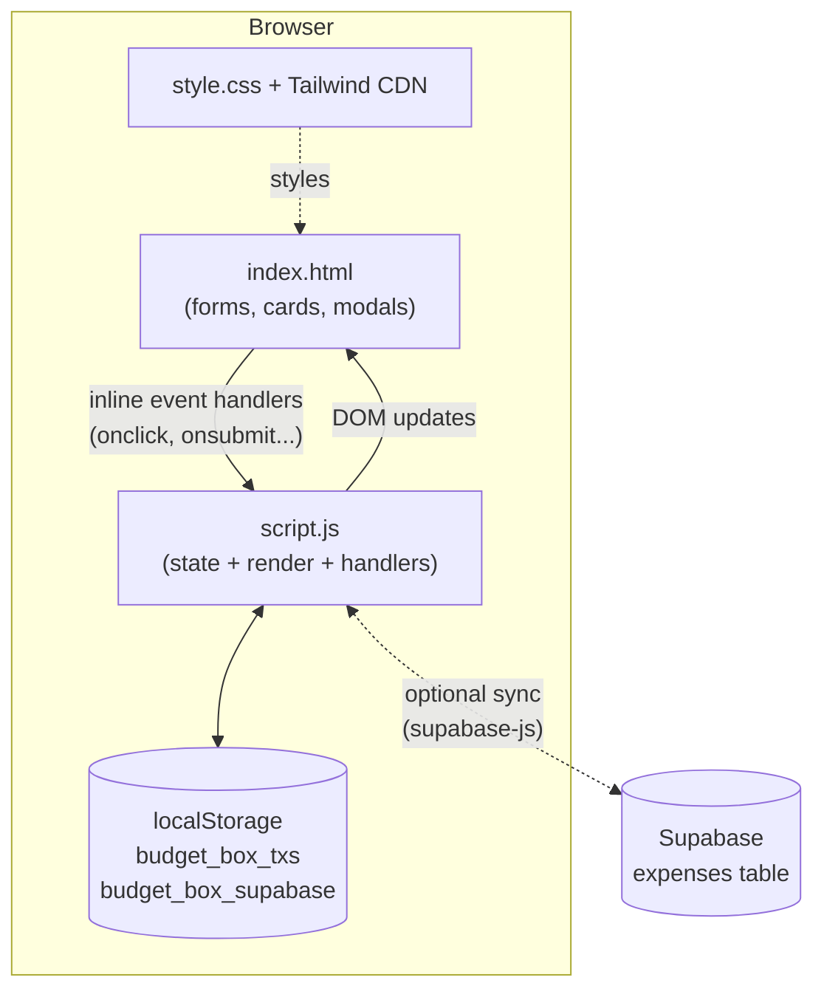
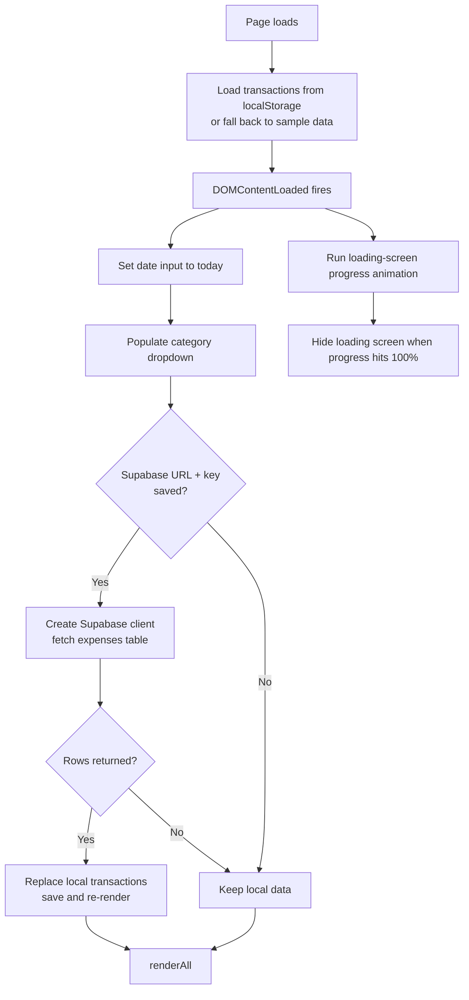
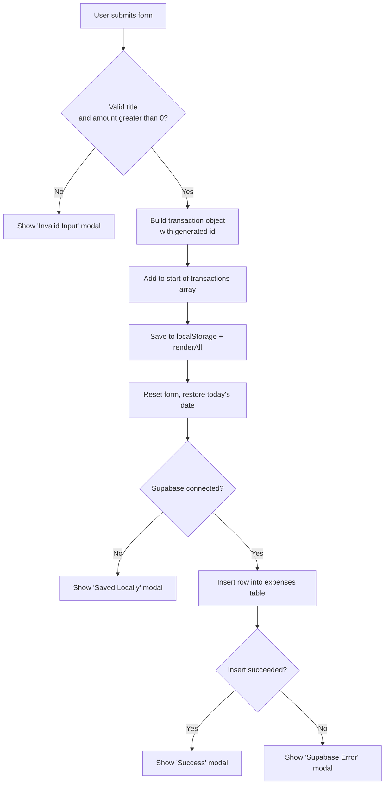

# BUDGET.BOX — Neo-Brutalist Expense Manager

A lightweight, framework-free expense tracker with a bold neo-brutalist UI. Log income and expenses, see a live category breakdown, search and filter your history, export to CSV, and optionally sync everything to a Supabase database.

Runs entirely in the browser. No build step, no backend to deploy.

---

## Features

- Add income and expense transactions (title, amount in ₹, category, date)
- Live summary cards: total balance, total income, total expenses
- Donut/pie chart of expenses by category, with a percentage legend
- Searchable and filterable transaction history
- Delete transactions
- Export all transactions to CSV
- Data persists in the browser via `localStorage`
- Optional cloud sync with Supabase (credentials entered in-app)
- Animated loading screen and custom modal notifications
- Responsive layout (mobile to desktop)

---

## Tech Stack

| Layer | Technology | Purpose |
|---|---|---|
| Markup | HTML5 | Page structure, forms, modals |
| Styling | Tailwind CSS (CDN play script) | Utility classes for layout, spacing, responsiveness |
| Styling | Custom CSS (`style.css`) | Neo-brutalist boxes, hard shadows, buttons, loader animation, scrollbar |
| Fonts | Google Fonts | Space Grotesk (UI), JetBrains Mono (numbers and labels) |
| Logic | Vanilla JavaScript (ES6+) | State, rendering, CRUD, filtering, CSV export |
| Charts | Hand-built SVG | Pie chart drawn with `stroke-dasharray` circles, no chart library |
| Local storage | Browser `localStorage` | Persists transactions and Supabase config |
| Cloud (optional) | Supabase JS Client v2 (jsDelivr CDN) | Insert and fetch transactions in an `expenses` table |

No npm, bundler, or framework is required.

---

## Project Structure

```
budget-box/
├── index.html    # Markup, CDN imports, links to CSS and JS
├── style.css     # Custom neo-brutalist styles and animations
├── script.js     # All application logic
└── README.md
```

---

## Architecture

The app is a single-page, client-side application with an in-memory state array as the source of truth for the UI.



### Layers inside `script.js`

| Layer | Key functions | Responsibility |
|---|---|---|
| State | `transactions`, `supabaseConfig`, `supabaseClient` | Holds the current ledger and cloud config |
| Persistence | `saveAndRefresh()` | Writes state to `localStorage`, then re-renders |
| Rendering | `renderAll()`, `renderMetrics()`, `renderTransactions()`, `renderPieChart()` | Rebuilds the UI from state |
| Actions | `handleFormSubmit()`, `deleteTransaction()`, `updateCategoryOptions()` | User-driven state changes |
| Export | `exportDataCSV()` | Builds and downloads a CSV |
| Cloud | `initSupabaseFromStorage()`, `saveSupabaseConfig()`, `testSupabaseSync()`, `fetchSupabaseTransactions()`, `syncInsertToSupabase()` | Supabase connection and sync |
| UI helpers | `showNotification()`, `closeNotification()`, `openSupabaseModal()`, `closeSupabaseModal()`, `escapeHtml()` | Modals and safe HTML output |

### Data model

Each transaction is a plain object:

```json
{
  "id": "tx_1728370000000ab12",
  "title": "Groceries Supermarket",
  "amount": 3200,
  "category": "Food",
  "type": "expense",
  "date": "2026-10-03"
}
```

| Type | Allowed categories |
|---|---|
| `expense` | Food, Travel, Bills, Shopping, Others |
| `income` | Salary, Others |

Each category has a fixed pastel color (`categoryColors`) used in the list icons and the pie chart.

---

## Application Flow

### 1. Startup



### 2. Adding a transaction



### 3. Rendering pipeline

Every state change goes through `saveAndRefresh()` which calls `renderAll()`:

1. `renderMetrics()` sums income and expenses and shows the net balance (formatted with the `en-IN` locale).
2. `renderTransactions()` applies the search text and category filter, then builds the list items.
3. `renderPieChart()` groups expenses by category and draws one SVG circle per category, using `stroke-dasharray` for the slice length and `stroke-dashoffset` for its position. It also builds the legend with percentages and amounts.

Search and category filter inputs call `renderTransactions()` directly on every change.

### 4. Other actions

| Action | What happens |
|---|---|
| Delete (✕) | Removes the item from state, saves to `localStorage`, re-renders, shows a modal |
| Export CSV | Builds a `data:text/csv` URI with all transactions and triggers a download |
| Change Type (Expense/Income) | Repopulates the category dropdown for that type |
| Test Sync | Creates a temporary client and runs a `select … limit 1` on `expenses` to verify credentials and schema |
| Save & Connect | Stores URL and key in `localStorage`, initializes the client, and fetches existing rows |

---

## Getting Started

### Run locally

1. Keep `index.html`, `style.css` and `script.js` in the same folder.
2. Open `index.html` in a browser, or serve the folder:

   ```bash
   npx serve .
   # or
   python -m http.server 8000
   ```

An internet connection is needed on first load for the Tailwind, Google Fonts and Supabase CDNs.

### Deploy

It's a static site, so it can be deployed as-is to Vercel, Netlify, GitHub Pages or any static host. No build command or output directory is needed.

---

## Optional: Supabase Setup

1. Create a project at [supabase.com](https://supabase.com).
2. In the SQL editor, create the table:

   ```sql
   create table expenses (
     id text primary key,
     title text not null,
     amount numeric not null,
     category text not null,
     type text not null,
     date date not null,
     user_id text
   );
   ```

   Use `text` for `id` because the app generates ids like `tx_1728370000000ab12`, which are not valid UUIDs.

3. Add row-level security policies that allow the `anon` role to `select` and `insert` (and `delete` if you add remote delete later). Without policies, requests will be rejected when RLS is on.
4. In the app, click **Supabase Sync**, paste your **Project URL** and **anon public key**, then click **Test Sync** and **Save & Connect**.

---

## Known Limitations and Ideas

- **Deletes are local only.** Deleting a transaction removes it from `localStorage` but not from Supabase, so it can reappear after the next fetch.
- **Remote data replaces local data.** On load, if Supabase returns any rows, they overwrite the local list (no merge).
- **No `user_id` is sent.** The schema lists the column, but the app doesn't populate it yet. Add auth if you need per-user data.
- **Credentials live in `localStorage`.** Only the public anon key should ever be used here, and RLS must protect the data.
- **Tailwind via the CDN play script** is convenient but not recommended for production; consider a build step for performance.
- **No edit feature.** Transactions can be added and deleted but not edited.
- **Possible improvements:** edit transactions, date range filters, monthly summaries, budgets per category, Supabase Auth, realtime subscriptions, PWA/offline support.

---

## License

Add your preferred license here (for example MIT).
